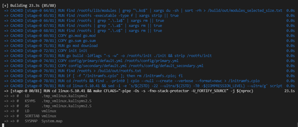

<!--
SPDX-FileCopyrightText: 2021 Belcan Advanced Solutions
SPDX-FileCopyrightText: 2021 Kaelan Thijs Fouwels <kaelan.thijs@fouwels.com>

SPDX-License-Identifier: Apache-2.0
-->

# os-next

Minimal, declarative, go based real-time capable linux runtime for deployment of containers at the edge, all in < 45MB.

Built against linux with the PREEMPT_RT patch set, with muslc and GCC.

Built as a single EFI, allowing fully declarative builds with one click "firmware" deployment, audit, and upgrade.

EFI based boot system, booted directly from UEFI, no bootloader required (or wanted).

Includes QEMU build target for testing/development. see `deploy/qemu`.

KConfig kernel configuration is derived from Alpine Linux, tailored for RT and specific module requirements.

Generic build target has been developed and deployed for:
- [OnLogic Karbon 700](https://www.onlogic.com/k300/)
- [OnLogic Karbon 300](https://www.onlogic.com/k700/)
- [Scheider Magellis](https://www.se.com/uk/en/product/HMIBMUSI29D2801/modular-box-pc-hmibm-universal-ssd-dc-windows-10-2-slots/)
- [IEI DRPC-230](https://www.ieiworld.com/en/product/model.php?II=714)
- [Hyper-V](https://docs.microsoft.com/en-us/virtualization/hyper-v-on-windows/about/)

Additional platforms may require additional kernel modules specified to be built and loaded via the primary config (see BUILDING), for full IO functionality. Specific device targets were consolidated to prevent excessive divergence, at the expense of a minor increase in binary size.

## Building

Build has been converted to build internally with docker/buildkit, full build process is defined in `Dockerfile`. legacy `build.sh` should not be used.

Full source build including kernel compression is runs in ~240 seconds with dual Xeon E5-2670 v3 @ 2.30 GHz. Limiting build factor is the final kernel/initramfs compression, ZSTD parallelism decays signficantly at higher ratios. Fast target will build from scratch in ~45 seconds at the expense of final binary size. 

Cached fast builds for development can be significantly faster (~15 seconds), recommended workflow for a full kernel build is to re-build the fast target, and run the qemu deploy target - see `deploy/qemu`.

Build will fetch, verify, and build sources, build go/uinit, before assembling into a linux build, and rootfs/initramfs, packed into a single distributable EFI.

EFI should be installed to a fat32 formatted partition 0 on a GPT disk, as `EFI/BOOT/BOOTx64.EFI`. This will allow booting via UEFI without an intermediary boot loader. Kernel parameters should be configured in the UEFI boot entry if required.

Ensure docker is compiling with buildkit for a layer based build log (highly recommended)

    export DOCKER_BUILDKIT=1 

Build the kernel EFI (`make <target> # make k300|schneider|...`)

    docker build -t <build arguments> os-next

The following build arguments are available.

_Included for documentation, see Makefile for existing targets, target should be added to makefile instead of direct calling_

    --build-arg CONFIG_PRIMARY=standard.yml # Override l1 config, one of config/primary - baked into the EFI
    --build-arg CONFIG_PRIMARY=secondary.yml # Override l2 config, of config/secondary - modifyable, and copied to the filesystem at runtime, if not existing.
    --build-arg CONFIG_MODULES=ALL # Override module set, ALL, or one of config/modules - defines modules compiled and shipped with EFI, to allow loading via primary/secondary config. Define as ALL to ship all modules, at the expensive of a huge build
    --build-arg COMPRESSION_LEVEL=9 # Override the default kernel ZSTD compression level (9 for fast, 22 for maximum)

Copy the kernel EFI from the built image to ./out (`make run`)

    docker run -it --rm -v $(PWD)/out:/out os-next

The dockerfile is constructed to cache layers between builds, if required files have not been modified. There is no need to preserve files on a volume (anymore)

## Deployment

The image is copied out of the container when the build is successfully completed and place in a subdirectory called `out` in current working director. The file is called BOOTx64.EFI

To deploy this onto a physical hardware device, this hardware needs to support UEFI boot, which is a modern boot loader, which is suported in most new BIOS implementaitons. 

To install, format a drive with the labels and filesystems stated in the primary config.

Then create a directory structure on this device <partition 1>/EFI/BOOT and copy the BOOTx64.EFI into the folder. The UEFI will identify this path and boot.

The OS will use the LABEL fields to map devices to mount points specified in the primary config. Device IDs (eg. /dev/sda1) are not used to allow common operation across disk types (eg. /dev/nvme0n1) 

See `deploy/qemu` for a software deployment. This will automatically format and set up a drive, before starting with QEMU/KVM.

Unless specified, run `make deploy-clean` within, to build and start the kernel and connect stdin/stdout over virtual IO.

## Info

In the container you can find the linux source directory under /build/src/linux... 

Use `menuconfig` to setup the kernel then copy the .config to /build/out 

    `cp .config /build/out`

This will copy the .config to the host machine.

## CI
CI will build, verify, scan, and statically check the build and uinit. The use of docker/buildkit allows build dependencies to be scanned at build and integration time. See `.github/workflows` for specific steps.

## History
Developed within Lagoni Engineering, subsequently acquired by Belcan International. Licensed as open source and continued in development by the original authors.

## License
Apache-2.0 and/or Apache-2.0 compatible

Licensing tracked via SPDX, see file level tags for specific attribution